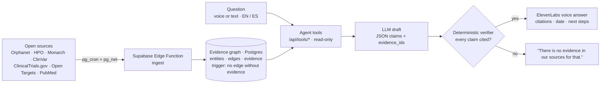

# Nedamex

### Rare disease, mapped. Every answer traced to its source.

**Hack-Nation 7th Global AI Hackathon · Challenge 5 · AI Atlas for Rare Diseases** (Buffalo Initiative × OpenAI)

**[▶ Live demo](https://nedamex.vercel.app)** *(deploying)* · [Videos](#videos) · [Architecture](docs/ARCHITECTURE.md) · [Team workflow](docs/WORKFLOW.md)

> The AI knows nothing on its own. It can only say what the graph backs with a source and a date.
> No source, no answer.

## How it works



| Guarantee | Enforced by |
|---|---|
| No relation without a source | Postgres trigger: an edge can't be `active` without ≥ 1 `evidence` row |
| No sentence without a citation | `src/lib/verifier.ts`, deterministic with no LLM, unit-tested |
| Every fact carries its date | `evidence.retrieved_at` is shown with each answer |
| Not medical advice | disclaimer on every answer + referral to a specialist |
| Privacy | no patient data is sold; trial contact only with explicit consent |

## Three audiences

| Audience | Voice agent | What they get | Access |
|---|---|---|---|
| Families & patients | **Family Guide** (warm, no jargon) | plain explanation, documented treatments, nearby trials, support groups | Free |
| Clinicians | **Clinical Analyst** (precise, cites ORPHA/HP/NCT) | phenotype-based differential (HPO), variants, cited literature | B2B |
| Researchers & pharma | **Research Analyst** (skeptical, shows gaps) | evidence map, research gaps, researcher community, trials | B2B + researcher portal |

## Stack

| Layer | Tech | Role |
|---|---|---|
| Data | **Supabase** (Postgres, pgvector, RLS, Edge Functions, pg_cron, pg_net) | evidence graph + scheduled ingestion |
| Web & API | **Next.js 16** on **Vercel** | landing, `/atlas`, `/api/ask`, `/api/tools/*` |
| Voice | **ElevenLabs Agents** | three personas calling our tools as server tools |
| LLM | **OpenAI** / **Claude** | drafting JSON claims only from retrieved evidence |
| Researcher portal | **Lovable** | B2B portal on the same Supabase (anon key + RLS) |
| Video | Remotion | submission videos (`video/`) |

## Videos

| Demo | Tech | Team |
|---|---|---|
| *coming soon* | *coming soon* | *coming soon* |

## Quick start

```bash
git clone https://github.com/perdomoangelrangel-tech/7th-Hack-Nation-Global-AI-Hackathon-proyect nedamex && cd nedamex
npm run setup        # .env from .env.example, install, typecheck, lint
# fill .env with your Supabase URL + keys, then apply supabase/migrations/*.sql in order
npm run dev          # http://localhost:3000 · /atlas · /api/health
npm test             # deterministic verifier tests
```

Without `OPENAI_API_KEY`, `/api/ask` runs in a deterministic demo mode built straight from the evidence.
Ingestion runs inside Supabase (Edge Function `ingest`, scheduled by pg_cron). `npm run ingest` is a local fallback.

## Repo map

```
src/app/             landing · /atlas · /api/ask · /api/tools/[tool] · /api/health
src/lib/             graph.ts (graph reads) · verifier.ts (+ tests) · agents/ (three personas)
supabase/            migrations (graph, evidence trigger, RLS) · functions/ingest · seed/
scripts/ingest/      local ingestion fallback
video/               Remotion scenes for the submission videos
docs/                architecture · data sources · research · agents · workflow
.claude/             Claude Code subagents, slash commands, QA kit
```

## Docs

[Architecture](docs/ARCHITECTURE.md) · [Data sources](docs/DATA_SOURCES.md) · [Research & business model](docs/RESEARCH.md) · [Agents](docs/AGENTS.md) · [Team workflow](docs/WORKFLOW.md) · [Design](DESIGN.md) · [Claude Code guide](CLAUDE.md)
*(ARCHITECTURE, DATA_SOURCES, RESEARCH and AGENTS are in Spanish; the diagrams render on GitHub.)*

## Scales by design

5 demo diseases today → 5,000+ monogenic diseases by swapping the seed for Orphadata's classification. Ingestion is idempotent by canonical ID (ORPHA, HGNC, HP, NCT, PMID). Postgres carries the graph to ~10M edges behind the same tool contract, and the schema is already multi-tenant B2B (organizations + RLS).

## Not medical advice

Nedamex shows sourced information, not diagnoses or treatment recommendations. Every answer ends with a disclaimer and points to a doctor or a center of expertise. We never sell patient data, and trial contact happens only with explicit consent.

Data: Orphanet (CC BY 4.0) · HPO · Monarch Initiative (CC BY 4.0) · ClinVar, PubMed, ClinicalTrials.gov (public domain) · Open Targets (CC0).

## Team

| Name | Role |
|---|---|
| [Name] | [Role] |
| [Name] | [Role] |
| [Name] | [Role] |
