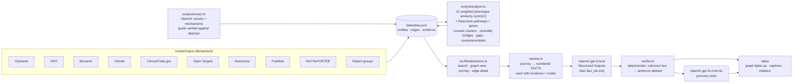

# Atlas · an evidence-backed map for rare diseases, narrated by voice

> Hack-Nation 7th Global AI Hackathon · **Challenge 5: AI Atlas for the World's Rare Diseases** (Buffalo Initiative × OpenAI)
>
> Maria types her disease into one search box. The atlas follows it to a disrupted mechanism, a related disease, the community already working on it, a reusable asset and a concrete next step — and a voice walks her through it while the graph lights up the edge behind every sentence. **Every edge has a source. Inferred links are labelled as hypotheses. If there is no supported lead, the atlas says so and shows what evidence would change that.**

**Run it in 60 seconds** — no keys, no database:

```bash
git clone https://github.com/perdomoangelrangel-tech/7th-Hack-Nation-Global-AI-Hackathon-proyect.git
cd 7th-Hack-Nation-Global-AI-Hackathon-proyect
npm install
npm run dev          # http://localhost:3000  →  /atlas
```

The graph ships versioned in `data/atlas.json`. Without `OPENAI_API_KEY` the narration uses deterministic templates and the browser's voice; with the key it uses OpenAI for writing and for the voice (see [OpenAI](#built-with-openai)).

## The journey (what judges should try)

1. Open `/atlas` → **Start with Maria's case: STXBP1** (or search `SMEI`, `Munc18-1`, `hand wringing`, `Rett`).
2. The constellation re-arranges around STXBP1-DEE and the voice starts. Each sentence lights the nodes and edges it cites; citations appear under the caption.
3. Right panel, Maria's three questions + action:
   - **Connections** — KCNQ2-DEE and Dravet syndrome, with the shared symptoms (ranked by how informative they are), shared Reactome pathways and variant-effect comparison. *Inferred*, so it says so.
   - **Assets** — e.g. a recruiting registry/natural-history study that already spans STXBP1-DEE, Dravet, CDKL5 and FOXG1; reusable studies from neighbors with *what differs* (eligibility, variant effect).
   - **People** — patient groups of the neighbor diseases and researchers already funded/publishing on both (NIH RePORTER, PubMed).
   - **Next steps** — a plan a patient group can start this week, every step linked to its evidence; plus gaps and the **search coverage** (what we looked at, so "none found" means something).
4. Click any edge → source, relationship type, confidence, observed vs inferred, and contradicting evidence (stopped trials, conflicting ClinVar interpretations, unverified sites).
5. Switch persona (Maria · Devon · Priya · Dr. Osei) or language (EN/ES): same evidence, different order, tone and voice.

## Architecture



| Layer | Where | Notes |
| --- | --- | --- |
| Ingestion | `scripts/ingest/` | One module per source; every edge needs ≥1 evidence record (source, external id, URL, quote, dates) or it is not written. |
| Graph | `data/atlas.json` | Property graph: 10 node types, 10 relations, three edge kinds (`observed` / `inferred` / `extracted`). Same model as `supabase/migrations` (Postgres path to scale). |
| Analytics | `scripts/analyze.ts` | Deterministic, seeded. Writes `similar_to` edges as **inferred**, with their explanation and supporting edges. |
| Read API | `src/app/api/atlas/[view]` | `search`, `graph`, `journey`, `edge`, `constellation`, `stats`. |
| Narration | `src/app/api/narrate`, `src/lib/atlas/narrate.ts` | Facts → OpenAI → verifier. Template fallback without a key. |
| Voice | `src/app/api/speak` | OpenAI TTS with per-persona voice and instructions; browser speech fallback. |
| Agent tools | `src/app/api/tools/[tool]` | Read-only JSON tools (`disease`, `trials`, `treatments`, `literature`, `communities`, `gaps`, `phenotype-match`) for any external agent. |

More detail: [`docs/ARCHITECTURE.md`](docs/ARCHITECTURE.md) · sources: [`docs/DATA_SOURCES.md`](docs/DATA_SOURCES.md) · personas & voice: [`docs/AGENTS.md`](docs/AGENTS.md) · market: [`docs/RESEARCH.md`](docs/RESEARCH.md).

## How the graph is built and clustered (defensible, reproducible)

- **Nodes**: disease, gene, variant, phenotype (HPO), pathway (Reactome), trial/asset, paper, treatment, patient organization, investigator.
- **Phenotype similarity** = simGIC (Pesquita et al., 2008): weighted Jaccard over each disease's HPO terms *plus their ancestors*, each weighted by information content (`IC = −ln(diseases annotated / all HPO diseases)`) × Orphanet frequency. "Seizure" weighs little; "hypsarrhythmia" weighs a lot — the brief's *broad vs. unusually informative symptoms*.
- **Mechanism similarity** = Jaccard of Reactome pathways of the causal genes (leaf 0.7 + top-level 0.3).
- **Variant effect per disease, not per gene**: full ClinVar counts of pathogenic truncating vs. missense variants *for that disease*. Example: KCNQ2 overall has many truncating variants (benign neonatal epilepsy), but in KCNQ2-DEE 75 % are missense → mechanism likely differs from loss of function. *Same gene, different mechanisms.*
- **Score** = 0.55 · phenotype + 0.35 · pathway + 0.10 · shared gene → top-3 neighbors per disease (score ≥ 0.06) become `similar_to` **inferred** edges → Louvain communities (fixed seed).
- **Result on the first slice (9 monogenic neurodevelopmental diseases):** three clusters that match known biology without being told — ion-channel/synaptic DEEs (STXBP1, SCN1A, KCNQ2), the Rett-like group (MECP2, FOXG1, CDKL5, UBE3A) and the lysosomal NCLs (TPP1, CLN3). CLN2 shares seizures with the DEEs but no pathway: it is kept apart and surfaced as a **counterexample** (similar symptoms, different strategy).
- **Bridges**: investigators (NIH RePORTER profile ids, PubMed senior authors), patient organizations and trial sponsors linked to ≥2 diseases — the brief's *network overlap*.
- **Gaps**: no approved drug, no natural-history study, no registry, no active trial, no NIH funding, no patient group, few phenotypes — each with *what would change it*.

## Evidence integrity

| Kind | Meaning | In the map |
| --- | --- | --- |
| `observed` | A source states it (Orphanet, ClinVar, ClinicalTrials.gov, …) | solid line |
| `inferred` | Computed by `analyze.ts` from observed edges; stores its explanation and supporting edges | dashed gold line, always labelled *inferred* |
| `extracted` | Pulled by OpenAI from a cited abstract; the verbatim quote is checked against the abstract text, otherwise discarded | listed as "(from paper)" |

Contradicting evidence is shown next to the edge: stopped/withdrawn trials with their reason, ClinVar variants with conflicting interpretations, patient-group sites that did not respond at ingest. Integrity is enforced in tests (`src/lib/atlas/atlas.test.ts`): no edge without evidence, every `similar_to` is inferred, every narrated sentence cites evidence.

## Built with OpenAI

| Brief | What we do | Where |
| --- | --- | --- |
| **Extract** | Reusable assets (animal/cell models, biomarkers, outcome measures, registries) and variant-effect statements from PubMed abstracts, with Structured Outputs; each item needs a verbatim quote that must be found in the abstract. | `scripts/extract.ts` |
| **Reconcile** | Synonyms and identifiers are resolved deterministically (Orphanet/HPO/Monarch xrefs); OpenAI names clusters in plain language from their shared pathways and symptoms only. | `scripts/name-clusters.ts`, `store.search` |
| **Explain** | Turns a graph path into plain language for each persona; may only cite numbered facts, and the verifier deletes anything else. | `src/lib/atlas/narrate.ts` |
| **Voice** | `gpt-4o-mini-tts` with a voice and delivery instructions per persona. | `src/app/api/speak` |

Models are configurable: `OPENAI_MODEL` (default `gpt-6-luna`) and `OPENAI_TTS_MODEL` (default `gpt-4o-mini-tts`).

## Reproduce the dataset

```bash
cp .env.example .env.local      # optional: OPENAI_API_KEY, NCBI_API_KEY
npm run ingest -- --fresh       # ~2 min: 10 sources → data/atlas.json
npm run extract                 # optional, needs OPENAI_API_KEY
npm run analyze                 # clusters, similarity, bridges, gaps (+ plain cluster names with a key)
npm test                        # integrity tests on the snapshot
```

Seed: `supabase/seed/diseases.json` (ORPHA, MONDO, OMIM and ClinVar trait names verified against Orphanet/Monarch) and `supabase/seed/organizations.json` (official sites, checked live at ingest). A weekly GitHub Action rebuilds the snapshot and opens a PR (`.github/workflows/ingest.yml`).

## Search coverage

For every disease the journey reports what was searched: sources and their sync date, number of studies, papers, PubMed results since 2019, NIH projects, phenotypes and treatments, and whether Open Targets indexes the disease (KCNQ2-DEE is not indexed — reported as a coverage gap, not as "no drugs").

## Scaling

The seed list becomes Orphadata's classification (5,000+ monogenic diseases); ingestion is idempotent and source-modular; analytics are O(n²) over diseases today and move to candidate generation (shared pathway/phenotype index) beyond a few thousand. `npm run ingest -- --target=supabase` writes the same graph into Postgres (`supabase/migrations`, including multi-tenant RLS) behind the same read contract.

## Limitations (honest)

- 9 diseases in the first slice: the clusters are a demonstration of the method, not a census.
- Investigator identity from PubMed is name-based (shown with low confidence); NIH RePORTER ids are stable.
- Similarity weights are a reasoned starting point, not fitted; every inferred link is marked for expert review.
- Orphanet definitions are in English; the Spanish UI translates labels and narration, not source text.

## Not medical advice

Every narration ends with a disclaimer. Treatments approved in a neighbor disease are presented as questions for an expert, never as recommendations.
