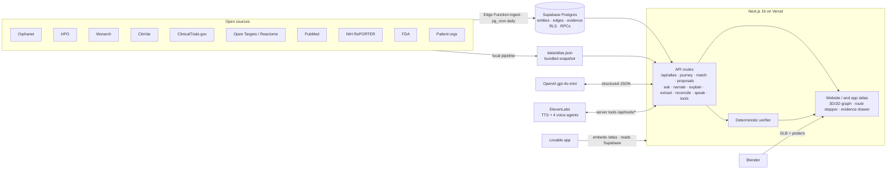

# Nedamex · the AI atlas for rare diseases

> Hack-Nation 7th Global AI Hackathon · **Challenge 05: AI Atlas for Rare Diseases** (OpenAI × Buffalo Initiative)
>
> One rule governs the whole system: **no claim without evidence.** Every link in the graph and every sentence the AI writes or speaks carries its source, its relationship type and how sure we are.

Nedamex is an evidence knowledge graph of rare diseases — diseases, genes and variants, mechanisms and pathways, symptoms, patient groups, papers, studies, reusable research assets and researchers — with a patient-first interface on top. It carries a family like Maria's (STXBP1) from an isolated diagnosis to a shared mechanism, a reusable asset, a collaborator and a concrete next step, and it says so honestly when there is no supported route.

**Not medical advice.** Nedamex shows sourced information to discuss with a clinician.

## Live

| Deliverable | URL |
| --- | --- |
| **Website** — the story, videos and how it works | https://nedamex.vercel.app |
| **Nedamex platform** (Lovable) — pick your role, search, then the atlas | https://nedamex.lovable.app |
| Medicines bank | https://nedamex.lovable.app/medicines |
| Community (for researchers & clinicians) | https://nedamex.lovable.app/community |
| The atlas engine (also runs standalone) | https://nedamex.vercel.app/atlas |
| Maria's demo route (STXBP1-DEE, family mode) | https://nedamex.vercel.app/atlas?p=maria&d=disease:ORPHA:599373 |

The flow is **website → "Open Nedamex" → platform home (who are you?) → your route in the atlas**. The Lovable platform embeds the same atlas engine (`?embed=1`) and reads the same Supabase graph, so both deliverables show one atlas.

Videos: **pitch** — on the website ([`public/videos/nedamex-pitch.mp4`](public/videos/nedamex-pitch.mp4)) · demo and tech videos — `[links added when published]`.

## How to use it

1. **Pick your role** — Patient or caregiver · Family & patient group · Researcher · Pharma & biotech. You can change it anytime.
2. **Search your disease** — by name, synonym, gene, symptom or mechanism ("Munc18-1" → STXBP1, "lysosomal storage" → its cluster), or browse all diseases.
3. **Follow your route** — four questions, one at a time, each lighting up the part of the map that explains it.
4. **Tap any line for its evidence** — source and external id, relationship, kind, confidence and any contradicting evidence; *Explain in plain words* rewrites it with OpenAI, still cited.

## What it does

- **Evidence graph.** 21 monogenic diseases across 5 mechanism clusters: 6,018 edges backed by 6,931 evidence rows from 11 sources, including 69 AI-extracted links that need expert review (at submission time; live numbers: [`/api/atlas/stats`](https://nedamex.vercel.app/api/atlas/stats)). An edge without evidence cannot exist (Postgres trigger + loader filter).
- **Four kinds of link, always visible.** `observed` (a source states it · solid line) · `inferred` (Nedamex analysis · dashed, "needs expert review") · `extracted` (OpenAI pulled it from a cited paper · dotted, "needs expert review") · `proposed` (community draft · ghost, never evidence).
- **Mechanism clusters, not name lists.** Louvain communities over phenotype information content, Reactome pathways and shared genes; each cluster is named by its dominant mechanism with the basis shown. Counterexamples ("same symptoms, different mechanism") are first-class.
- **A route, not a map.** Four questions answered only from the graph, each with its evidence one click away: who shares our disease characteristics → what useful work already exists → who could help → what we should do together next. Steps are labelled *Strong / Possible / Weak lead* and step 4 is a recommendation, never "observed".
- **Four modes.** Patient or caregiver · Family & patient group · Researcher · Pharma & biotech — same graph, different order and depth (plain-language cards, research tabs, a cluster table ranked by unmet need).
- **Co-creation.** Propose a hypothesis, a collaboration or missing evidence; drafts appear as ghost lines and never count as evidence.
- **The 10× route.** Typical vs Nedamex route to a shared natural-history study, every duration labelled as an assumption.

## Medicines bank

A searchable list of the medicines linked to the diseases in the atlas (Supabase view `medicines_public`, built from Open Targets known-drug evidence and ChEMBL ids). For each medicine: mechanism and targets, the indications it is linked to, its highest clinical stage and the **source link** behind every statement. Links are taken only from source API responses, never guessed. Nedamex shows what the sources say about a medicine; whether it fits a person is a decision for their clinician. A plain-language summary (`GET /api/medicine?id=treatment:CHEMBL…`) is written only from graph facts, every sentence cited, and always ends with *"Whether it fits a person is a decision for their clinician."* The list is also available as `GET /api/medicines?q=&d=&approved=`. **No doses, no efficacy claims, no recommendations.**

## Community

For the **Researcher & clinician** role only. Researcher profiles come from NIH RePORTER principal investigators already linked to diseases in the atlas (Supabase view `community_profiles_public`), each with the funded project as its source. Researchers can add their own profile or start a research project through the `submit_profile` RPC — explicit consent required; self-submitted profiles are stored separately (`profile_submissions`), labelled **"not verified · not evidence"**, and never change the graph. API: `GET /api/community?d=&q=` · `POST /api/community/profile` (consent required). In the atlas, step 3 of the route shows researchers who share the mechanism, with the NIH RePORTER record as evidence.

## Architecture



- **Frontend** — Next.js 16 App Router, React 19, Tailwind 4, `react-force-graph-3d/2d` (3D with a 2D fallback for reduced motion, small screens and no WebGL), three.js / React Three Fiber, `motion`, `lucide-react`.
- **Backend** — Next.js route handlers on Vercel; CORS for the Lovable app is exact-origin only (`src/proxy.ts`).
- **Data** — Supabase Postgres as a property graph (migrations in `supabase/migrations/`), Edge Function `ingest` triggered by `pg_net` and scheduled with `pg_cron`; RLS on every table; community drafts and AI extractions written only through `security definer` RPCs. The app serves the richer bundled snapshot until the live graph reaches parity (coverage guard in `src/lib/atlas/source.ts`).
- **Verifier** — `src/lib/verifier.ts` is deterministic and unit-tested: a sentence without evidence ids from the graph is dropped before it is shown or spoken; doses, cure promises and PII are blocked; inferred links are always hedged. Red-team suite: `node .claude/qa/redteam.mjs <url>`.
- **OpenAI** — Explain (plain language that cites every sentence), Reconcile (names → graph entities, choosing only among our candidates) and Extract (claims with the exact quote from a cited paper, saved as `extracted` edges that need expert review). Every response reports `mode: "openai" | "deterministic"`; everything has a deterministic fallback. Details: [`docs/OPENAI.md`](docs/OPENAI.md).
- **ElevenLabs** — one voice per mode for narration (`/api/speak`, browser speech as fallback) and four conversational agents (Patient Guide, Family & Patient-Group Navigator, Research Analyst, Pharma Scout) whose server tools read the graph through `/api/tools/*` and return evidence ids.
- **Blender** — the hero (a DNA helix growing from the logo's forest into the graph), the voice-agent avatar and one glyph per entity type, built reproducibly with `blender/*.py` and exported as compressed GLB (`public/models/`).

More: [`docs/ARCHITECTURE.md`](docs/ARCHITECTURE.md) · [`docs/DATA_SOURCES.md`](docs/DATA_SOURCES.md) · [`DESIGN.md`](DESIGN.md).

## Run it locally

Requirements: Node 20+ and npm.

```bash
git clone https://github.com/perdomoangelrangel-tech/7th-Hack-Nation-Global-AI-Hackathon-proyect.git nedamex
cd nedamex
npm install
npm run dev            # http://localhost:3000 (website) · /atlas (app) · /api/health
```

No configuration is needed to explore: the public Supabase URL and publishable key are built in (read-only by RLS) and the app falls back to the bundled `data/atlas.json`. Without model keys every AI feature runs in a deterministic, fully cited mode.

Optional `.env.local` (see `.env.example`; never commit it):

| Variable | Enables |
| --- | --- |
| `OPENAI_API_KEY`, `OPENAI_MODEL`, `OPENAI_MODEL_FAST` | Live Explain / Ask / Narrate / Reconcile / Extract (`gpt-4o-mini` recommended) |
| `ELEVENLABS_API_KEY` | ElevenLabs voices for narration (`/api/speak`) |
| `NCBI_API_KEY` | Faster PubMed / ClinVar ingest |

Checks: `npm run typecheck && npm run lint && npm test && npm run build`.

## Reproduce the dataset

1. **Disease slice.** `npx tsx scripts/resolve-seed.ts` resolves and verifies every id of the 21 diseases (Orphadata preferred term + disease-causing gene, HGNC, MONDO, OMIM, ClinVar trait). Unverifiable candidates are left out, never guessed.
2. **Ingest to the bundled snapshot.** `npm run ingest` runs the local pipeline over all sources into `data/atlas.json` (`--orpha=ORPHA:…` for one disease, `--only=<source>` for one source, `--fresh` to rebuild).
3. **Analytics.** `npm run analyze` computes mechanism clusters, similarity explanations, bridges, gaps and counterexamples (`src/lib/atlas/analyze.ts`, pure and deterministic).
4. **Live graph.** Apply `supabase/migrations/*` to a Supabase project, deploy the Edge Function `supabase/functions/ingest`, and trigger it per disease (`pg_net`, or the `ingest` GitHub workflow); `0012_nexmed_cron.sql` schedules a daily refresh. `npm run snapshot` exports the live graph back to the snapshot format.
5. **AI extraction (optional).** With `OPENAI_API_KEY`: `npm run extract -- --limit 40` extracts claims from the PubMed papers in the graph (idempotent by PMID) and saves them with `save_extraction`.

Integrity checks: `.claude/qa/integrity.sql` (every `expect = 0` row must be 0).

**Sources & coverage:** [`GET /api/atlas/sources`](https://nedamex.vercel.app/api/atlas/sources) lists every source with its license, last read and edge / evidence counts per kind (observed · inferred · extracted).

### Add a disease or a source

- **A disease:** put its ORPHA code in `supabase/seed/diseases.json` and verify it (`npx tsx scripts/resolve-seed.ts` — never guess an id), regenerate the Edge Function seed (`npx tsx scripts/build-edge-seed.ts`) and deploy `ingest`, run the ingest for it (`select private.invoke_ingest('ORPHA:<code>','all')` via pg_net, or the `ingest` GitHub workflow), then `npm run snapshot`. Clusters, similarity and the route are recomputed automatically. Step by step: [`docs/ADD_A_DISEASE.md`](docs/ADD_A_DISEASE.md).
- **A source:** add a module under `supabase/functions/ingest/sources/` (and `scripts/ingest/sources/` for the local pipeline) that writes entities, edges and evidence rows with `source`, `external_id`, `url` and `retrieved_at`; register the source id in a new migration.
- **From the platform:** on https://nedamex.lovable.app anyone can *Request a disease* or *Suggest a data source*; requests are stored as community drafts and never count as evidence.

## Data and licenses

| Source | License |
| --- | --- |
| Orphanet / Orphadata, Monarch, Reactome | CC BY 4.0 |
| Human Phenotype Ontology | HPO license |
| Open Targets | CC0 |
| ClinVar, PubMed metadata, ClinicalTrials.gov, NIH RePORTER, FDA | Public domain |
| Patient organizations | Public information from each organization's official site |
| UI sound effects (Kenney "Interface Sounds" + "RPG Audio", `public/sfx/`) | CC0 1.0 |

Every evidence row stores `source`, `external_id`, `url` and `retrieved_at`. Code license: `[to be chosen by the team]`.

## Security & privacy

- Secrets live only in server-side environment variables; `.env*` is git-ignored and the git history was scanned for key patterns (none found). `npm audit --omit=dev`: 0 vulnerabilities at release.
- Row-Level Security on every Supabase table; public writes only through validated, rate-limited `SECURITY DEFINER` RPCs; input-size limits on the AI APIs; contact details encrypted at rest (pgcrypto + Vault, migration `0016`).
- Security headers on every response (HSTS, nosniff, Referrer-Policy, Permissions-Policy, CSP `frame-ancestors` so only the Nedamex platform can embed the atlas; full CSP in report-only), CORS limited to exact origins.
- Voice agents keep no audio recordings; transcripts are kept 30 days.
- Report vulnerabilities privately: see [`SECURITY.md`](SECURITY.md).

## Terms of use

Nedamex is a research and information prototype, **not medical advice**: it never shows doses, inferred and AI-extracted links need expert review, and community drafts are never evidence. Full terms: [`docs/TERMS.md`](docs/TERMS.md).

## Team

- **Ángel Perdomo Rangel** — CEO & Founder
- **Yves Du Solier López** — Executive Creative Director & Co-founder
- **Jhoel Francisco Velasco Bazan** — Chief Marketing Officer

---

Nedamex is a product of **Nedamex**. Built with OpenAI · ElevenLabs · Supabase · Vercel · Lovable · Blender.
