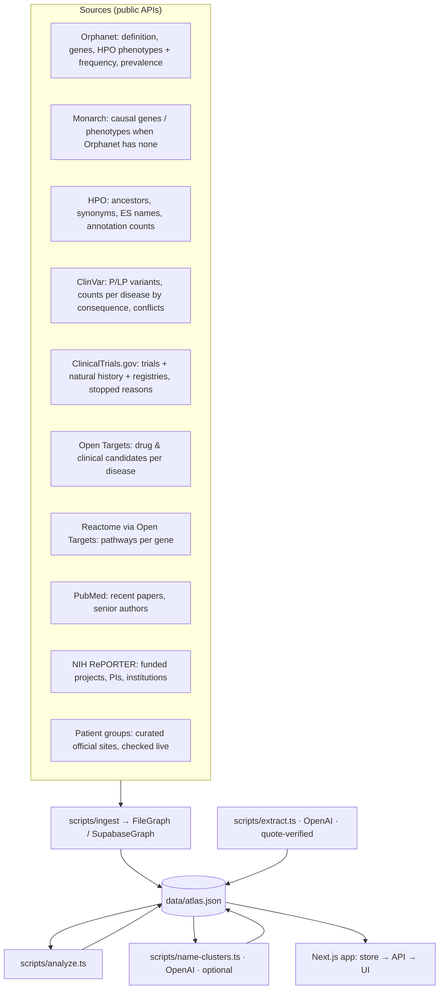

# Architecture

The rule that governs the system: **the AI knows nothing on its own.** It can only say what the graph backs with a source and a date, and anything it says is checked by a deterministic verifier before anyone hears it.

## 1. Data flow



## 2. Data model

`src/lib/atlas/types.ts` (snapshot) mirrors `supabase/migrations` (Postgres).

- **Entity** `{ id: "<type>:<canonical_id>", type, canonical_id, name, props, aliases[] }` — types: `disease, gene, variant, phenotype, pathway, trial, study, treatment, organization, investigator`. Canonical ids: `ORPHA:`, `SYMBOL:`, `HP:`, `REACT:R-HSA-`, `NCT…`, `PMID:`, `CHEMBL…`, `NIH:<profile_id>`, `ORG:<slug>`.
- **Edge** `{ id, from, to, relation, kind, confidence, confidence_basis, props, evidence[] }` — relations: `causes, has_phenotype, has_variant, studies, treats, supports, researches, participates_in, is_a, similar_to`. `kind ∈ observed | inferred | extracted` and is part of the edge id, so an inferred or extracted edge can never overwrite an observed one.
- **Evidence** `{ id, source, external_id, url, quote, published_on, retrieved_at }`. An edge with zero evidence is never written (and a Postgres trigger enforces the same in the scale path).
- **Analytics** `{ clusters, disease_cluster, centrality, variant_effect, similarity, bridges, gaps, counterexamples, method }`.

Confidence bases are explicit strings (`hpo_frequency`, `clinical_stage`, `clinvar_significance`, `nih_funded_project`, `senior_author_name_match`, `curated_site_unverified`, `atlas_similarity_v1`, `llm_extraction_quote_verified`, …) and are shown in the UI next to the number.

## 3. Analytics (`scripts/analyze.ts`)

1. **Information content** per HPO term and ancestor: `IC = −ln(n/N)/ln(N)` with `n` = diseases annotated in HPO, `N` = all diseases under *Phenotypic abnormality*. Ancestors with IC < 0.25 are ignored.
2. **Disease profile**: weights `confidence(frequency) × IC` over direct terms and their ancestors (upward closure).
3. **Phenotype similarity**: simGIC = Σ min / Σ max over the two profiles.
4. **Pathway similarity**: 0.7 · Jaccard(leaf Reactome pathways of causal genes) + 0.3 · Jaccard(top-level terms).
5. **Variant effect** per disease from ClinVar counts (`<gene>[gene] AND P/LP AND "<trait>"[dis]` by molecular consequence); Orphanet's own "loss/gain of function" wording wins when present.
6. **Score** `0.55·phen + 0.35·path + 0.10·sharedGene`; top-3 per disease with score ≥ 0.06 → `similar_to` (inferred) with explanation and supporting edge ids.
7. **Clusters**: Louvain (resolution 1, fixed seed) on the weighted similarity graph; named by the most cluster-specific Reactome pathway (or phenotype), then optionally in plain language by OpenAI.
8. **Centrality**: weighted degree, 0–100. **Bridges**: investigators/organizations/sponsors linked to ≥2 diseases (flag: cross-cluster). **Gaps** with "what would change it". **Counterexamples**: phenotype similarity ≥ median but zero shared pathway across clusters.

## 4. Narration and verification

```mermaid
sequenceDiagram
  participant UI as /atlas
  participant API as /api/narrate
  participant S as store.journey
  participant F as buildFacts
  participant M as OpenAI (Responses + Structured Outputs)
  participant V as verifier
  UI->>API: disease, persona, locale
  API->>S: journey (connections, assets, people, steps, gaps, coverage)
  S->>F: journey
  F-->>API: FACTS [f1..fn] each {status, text, evidence_ids, nodes, edges}
  API->>M: persona tone + rules + FACTS
  M-->>API: claims [{text, fact_ids}]
  API->>V: fact_ids → evidence_ids; unknown → deleted
  V-->>UI: verified claims + evidence + nodes/edges to light
  UI->>UI: per claim: /api/speak (persona voice) · light nodes · show citations
```

Without a key the same facts are narrated by a template with per-kind quotas (connection → asset → collaborator → step). Facts marked *inferred* must be voiced as hypotheses; *gap* facts are backed by a synthetic `coverage:` evidence record listing what was searched.

## 5. UI

- `src/components/atlas/GraphCanvas.tsx` — canvas (react-force-graph-2d / d3-force). Diseases are stars colored by cluster (size = centrality); dashed gold = inferred; spoken nodes glow, everything else dims, particles travel along cited edges; custom fit keeps the spoken subgraph above the narration bar; node positions persist across focus changes; gentle gravity keeps disconnected clusters on screen; respects `prefers-reduced-motion`.
- `JourneyPanel` (the three questions + next steps), `EdgeInspector` (source, type, confidence, contradictions), `NarrationBar` (captions, citations, progress), `SearchBox` (combobox with visible synonym resolution), `useNarration` (OpenAI voice with prefetch; browser voice with minimum read time and hang protection).
- Motion uses `motion/react` with shared tokens (`src/lib/motion.ts`); all UI strings in `src/lib/i18n.ts` (EN/ES).

## 6. Scale path

- Seed → Orphadata classification; each source module is independent and idempotent.
- `--target=supabase` writes into Postgres with RLS (`0001_graph.sql`, `0002_users.sql`, `0003_mechanisms.sql`).
- Pairwise similarity becomes candidate generation through shared pathway/phenotype postings before scoring.

## 7. Deliberate non-goals

No diagnosis, no dosing, no ranking of treatments for a patient, no storage of patient data in the demo, no relation without a source.
