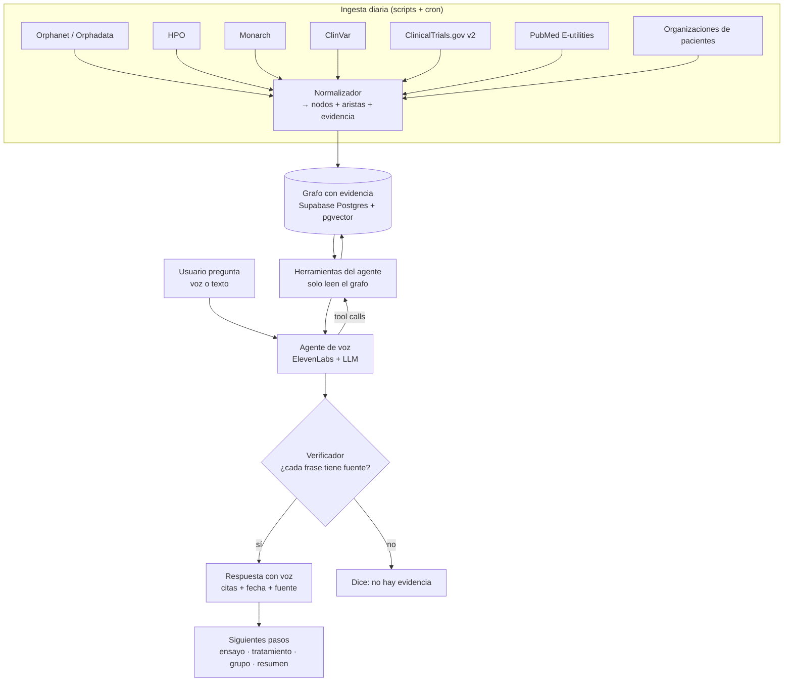
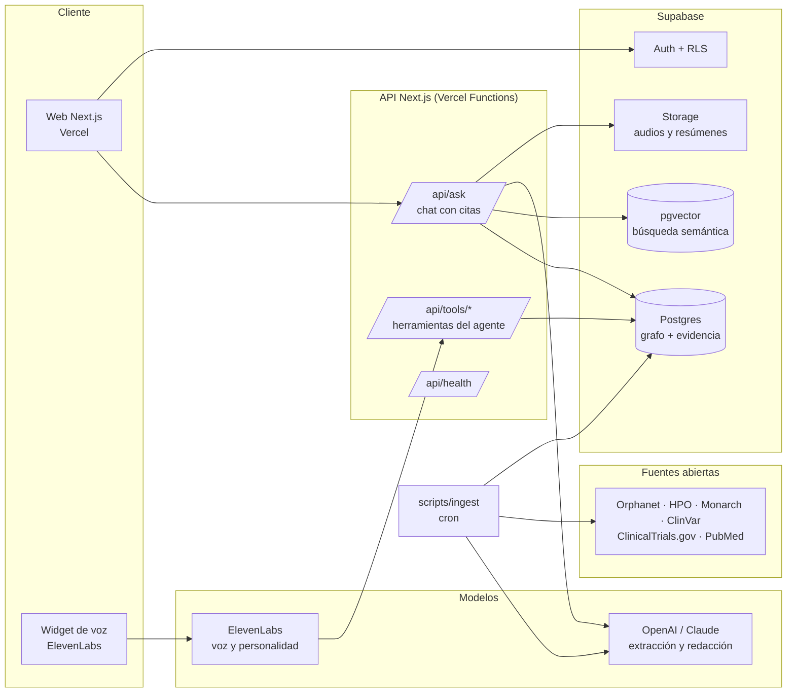
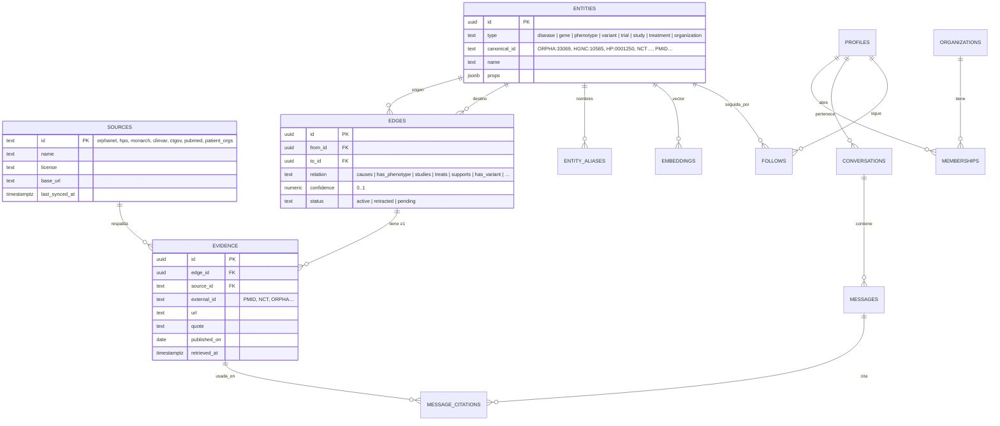
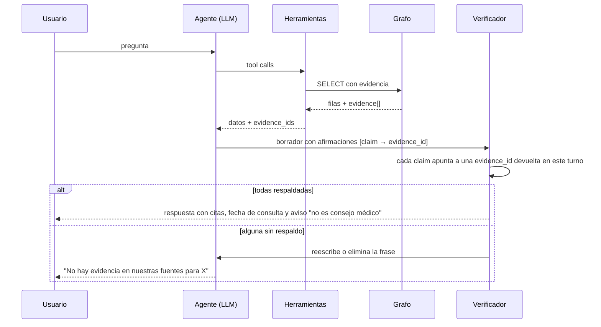

# Arquitectura

> Reto 5 · AI Atlas for Rare Diseases (Buffalo Initiative × OpenAI) · Hack-Nation 7
>
> Regla que gobierna todo el sistema: **la IA no sabe nada por sí misma. Solo puede decir lo que el grafo respalda con una fuente y una fecha.**

## 1. Qué construimos

Un atlas con IA que conecta enfermedades raras, genes, síntomas, variantes, estudios, ensayos clínicos, tratamientos y grupos de pacientes en un **grafo de conocimiento con evidencia**, y lo expone a tres públicos a través de **agentes de voz con personalidad**:

| Público | Agente | Qué obtiene |
| --- | --- | --- |
| Familias y pacientes (acceso gratuito) | Guía de familias | Explicación simple, síntomas a vigilar, tratamientos y manejo documentados, ensayos cercanos, grupos de apoyo |
| Médicos y clínicas (B2B) | Analista clínico | Diagnóstico diferencial por fenotipo (HPO), variantes relevantes, guías y evidencia con citas |
| Investigadores y farma (B2B) | Analista de investigación | Mapa de evidencia por enfermedad, huecos de investigación, comunidad de investigadores, ensayos y cohortes |

## 2. Flujo que gobierna el producto

Es el mismo flujo del documento base. Toda pregunta pasa por el grafo y por el verificador antes de convertirse en voz.

### Dónde vive cada paso

| Paso del flujo | Dónde corre | Código |
| --- | --- | --- |
| Ingesta diaria | Script Node (local o GitHub Action programada) | `scripts/ingest/*` |
| Grafo con evidencia | Supabase Postgres | `supabase/migrations/*` |
| Usuario pregunta | Next.js (web) + ElevenLabs (voz) | `src/app/atlas`, `src/app/api/ask` |
| Agente de voz | ElevenLabs Agents con herramientas HTTP → nuestra API | `src/lib/agents/*`, `src/app/api/tools/*` |
| Herramientas del agente | Rutas API que solo ejecutan consultas de lectura | `src/app/api/tools/*` |
| Verificador | Función pura que compara cada afirmación con las evidencias devueltas | `src/lib/verifier.ts` |
| Respuesta y siguientes pasos | Next.js: tarjetas con citas, botones de acción | `src/components/*` |

## 3. Componentes

## 4. Modelo de datos: grafo de propiedades sobre Postgres

Elegimos **Postgres como grafo** (tablas `entities`, `edges`, `evidence`) en vez de una base de grafos dedicada. Razones: Supabase ya lo da con auth, RLS, realtime y vector; una consulta de 2 o 3 saltos se resuelve con CTE recursivas; y el equipo lo conoce. Si el grafo pasa de decenas de millones de aristas, se migra a Neo4j/Memgraph manteniendo el mismo contrato de API.

Reglas duras del modelo:

1. **Una arista sin evidencia no existe.** Trigger en Postgres: no se puede insertar una `edge` activa sin al menos una fila en `evidence`.
2. **Toda evidencia tiene `retrieved_at`.** La fecha de consulta sale en cada respuesta.
3. **Las entidades se identifican por su ID canónico externo** (ORPHA, HGNC, HP, NCT, PMID). Así la ingesta es idempotente: correrla dos veces no duplica nada.
4. **Los datos de usuarios viven aparte** (`profiles`, `conversations`, `messages`) con RLS. El grafo es público de lectura; el historial es privado.

## 5. Contrato de la API y de las herramientas del agente

Todas devuelven JSON con `data` y `evidence[]`. Ninguna devuelve texto libre sin citas.

| Herramienta | Entrada | Salida |
| --- | --- | --- |
| `GET /api/tools/disease` | `q` (nombre u ORPHA) | ficha de la enfermedad, genes, fenotipos, prevalencia + evidencias |
| `GET /api/tools/phenotype-match` | `hpo[]` | enfermedades candidatas ordenadas por coincidencia + evidencias |
| `GET /api/tools/trials` | `disease`, `country?`, `status?` | ensayos activos con sitios + evidencia (NCT) |
| `GET /api/tools/treatments` | `disease` | tratamientos y manejo documentados + evidencia (PMID / guía) |
| `GET /api/tools/literature` | `disease`, `gene?` | artículos recientes + PMID |
| `GET /api/tools/communities` | `disease` | organizaciones de pacientes y comunidad de investigadores |
| `GET /api/tools/gaps` | `disease` | relaciones con poca o ninguna evidencia (huecos de investigación) |
| `POST /api/ask` | `question`, `audience`, `conversation_id?` | respuesta redactada por el LLM **solo** con las evidencias recuperadas, ya verificada |

## 6. Verificador

Implementación: el LLM debe responder en JSON `{claims:[{text, evidence_ids[]}]}`. El verificador rechaza cualquier `claim` cuyo `evidence_ids` esté vacío o no coincida con las evidencias del turno. Es determinista: no usa otro LLM para verificar.

## 7. Agentes con personalidad

Ver `docs/AGENTS.md`. Resumen: los tres agentes comparten las mismas herramientas; cambian el tono, el nivel técnico y los siguientes pasos que proponen. Ninguno tiene conocimiento en el prompt; solo instrucciones de comportamiento.

## 8. Escalado

| Dimensión | Hoy (hackathon) | Después |
| --- | --- | --- |
| Enfermedades | 5 demo (ver `supabase/seed/diseases.json`) | 5,000+ monogénicas corriendo la misma ingesta por ORPHA code |
| Ingesta | Script manual `npm run ingest` | GitHub Action diaria + cola en Postgres (`ingest_jobs` con `FOR UPDATE SKIP LOCKED`) |
| Consultas | SQL directo | Vistas materializadas por enfermedad + caché de respuestas frecuentes |
| Grafo | Postgres | Postgres hasta ~10M aristas; luego Neo4j con el mismo contrato de herramientas |
| Modelos | Un LLM por petición | Modelo pequeño para extracción, grande solo para redacción; respuestas cacheadas |
| Idiomas | ES / EN | ElevenLabs cubre 100+ idiomas; la evidencia conserva su idioma original |
| Clientes | Un tenant | `organizations` + RLS por organización ya en el esquema |

## 9. Decisiones y trade-offs

| Decisión | Alternativa | Por qué así |
| --- | --- | --- |
| Postgres como grafo | Neo4j | Una sola plataforma, RLS, vector y realtime incluidos; suficiente para millones de aristas |
| Verificador determinista | "LLM que revisa al LLM" | Reproducible, barato, y no puede alucinar la verificación |
| Agentes con herramientas, sin conocimiento en el prompt | RAG clásico con chunks | Cada dato llega estructurado con su evidencia; la cita es exacta, no aproximada |
| Ingesta idempotente por ID canónico | Scraping libre | Rerunnable, auditable, y escala a cualquier enfermedad sin tocar código |
| Next.js en Vercel + Supabase | Backend propio | Cero infraestructura que mantener en 24 h; escala sin cambios |

## 10. Lo que no hacemos (a propósito)

- No damos consejo médico. Cada respuesta lleva aviso y deriva a un especialista.
- No inferimos relaciones que no estén en una fuente. Un hueco es un hueco.
- No vendemos datos de pacientes. El contacto para ensayos es siempre con consentimiento explícito.
