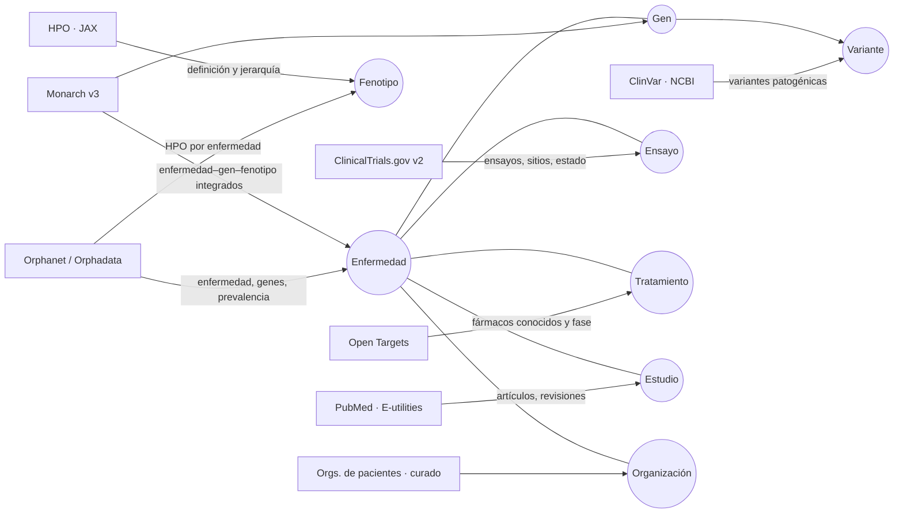

# Fuentes de datos

Todas son abiertas, con API pública y licencia que permite reutilización con atribución. Cada fila que entra al grafo guarda `source_id`, `external_id`, `url` y `retrieved_at`.

> Las URLs se verificaron por documentación oficial. Mi sandbox no tiene salida a estos dominios, así que la primera prueba real se hace desde `npm run ingest` en una máquina del equipo o desde Vercel. Si un endpoint cambió, el script de esa fuente es el único archivo que se toca.

## Mapa de qué fuente alimenta qué parte del grafo

## Detalle por fuente

| Fuente | Qué tomamos | Endpoint base | Clave | Límite | Licencia |
| --- | --- | --- | --- | --- | --- |
| **Orphanet / Orphadata** | Ficha de enfermedad por ORPHA code, genes asociados, fenotipos HPO con frecuencia, prevalencia, cruces a OMIM/ICD | `https://api.orphadata.com/` — `rd-cross-referencing/orphacodes/{code}`, `rd-associated-genes/orphacodes/{code}`, `rd-phenotypes/orphacodes/{code}`, `rd-epidemiology/orphacodes/{code}` (parámetro `lang=en`) | No | Uso razonable | CC BY 4.0 |
| **HPO (JAX)** | Definición, sinónimos y padres de cada término HP | `https://ontology.jax.org/api/hp/terms/{HP:id}`; búsqueda: `https://clinicaltables.nlm.nih.gov/api/hpo/v3/search?terms={texto}` | No | Uso razonable | HPO license (atribución) |
| **Monarch Initiative v3** | Asociaciones enfermedad–gen–fenotipo ya integradas con MONDO; búsqueda por nombre | `https://api-v3.monarchinitiative.org/v3/api/search?q={texto}`; `…/v3/api/association?subject={MONDO}&category=biolink:DiseaseToPhenotypicFeatureAssociation` | No | Uso razonable | CC BY 4.0 / BSD |
| **ClinVar (NCBI)** | Variantes con significado clínico por gen | `https://eutils.ncbi.nlm.nih.gov/entrez/eutils/esearch.fcgi?db=clinvar&term={GEN}[gene]+AND+pathogenic[CLNSIG]&retmode=json` → `esummary.fcgi?db=clinvar&id={ids}&retmode=json` | Opcional (`NCBI_API_KEY`, sube de 3 a 10 req/s) | 3 req/s sin clave | Dominio público (NCBI) |
| **ClinicalTrials.gov v2** | Ensayos por condición, estado, países y sitios | `https://clinicaltrials.gov/api/v2/studies?query.cond={enfermedad}&filter.overallStatus=RECRUITING,NOT_YET_RECRUITING&pageSize=50&format=json` | No | Uso razonable | Dominio público |
| **Open Targets Platform** | Fármacos conocidos por enfermedad con fase clínica y mecanismo | `POST https://api.platform.opentargets.org/api/v4/graphql` (query `disease(efoId){knownDrugs{rows{drug{name} phase mechanismOfAction}}}`) | No | Uso razonable | CC0 |
| **PubMed (E-utilities)** | Artículos y revisiones recientes por enfermedad o gen, con PMID y fecha | `esearch.fcgi?db=pubmed&term={consulta}&sort=date&retmax=25&retmode=json` → `esummary.fcgi?db=pubmed&id={ids}&retmode=json` | Opcional (`NCBI_API_KEY`) | 3 req/s sin clave | Dominio público (metadatos) |
| **Organizaciones de pacientes** | Nombre, país, sitio web, enfermedad | Archivo curado `supabase/seed/organizations.json` (NORD, EURORDIS, Global Genes, fundaciones específicas) | — | — | Datos públicos de cada organización |

## Qué pasa con cada registro al entrar

1. **Normalizar el ID**: ORPHA, MONDO, HGNC, HP, NCT, PMID, CHEMBL. El ID canónico es la llave de `entities` (`type + canonical_id`), por eso correr la ingesta dos veces no duplica.
2. **Crear o actualizar la entidad** con `ON CONFLICT (type, canonical_id) DO UPDATE`.
3. **Crear la arista** (`causes`, `has_phenotype`, `has_variant`, `studies`, `treats`, `supports`, `serves`).
4. **Adjuntar la evidencia** con `source_id`, `external_id`, `url`, `published_on`, `retrieved_at` y, cuando aplica, una cita literal corta.
5. **Confianza**: viene de la fuente cuando existe (frecuencia HPO, fase clínica, significado ClinVar). Si no, 0.5 y se marca `confidence_basis = 'source_default'`.

## Enfermedades demo (seed)

Cinco monogénicas de inicio pediátrico y afectación neurológica, alineadas con la misión de Buffalo Initiative:

| Enfermedad | ORPHA | Gen | Por qué |
| --- | --- | --- | --- |
| Síndrome de Dravet | ORPHA:33069 | SCN1A | Epilepsia genética con ensayos activos y comunidad fuerte |
| Síndrome de Rett | ORPHA:778 | MECP2 | Tiene fármaco aprobado reciente: muestra el nodo "tratamiento" |
| Trastorno por deficiencia de CDKL5 | ORPHA:505652 | CDKL5 | Fundaciones de pacientes muy activas en investigación |
| Síndrome de Angelman | ORPHA:72 | UBE3A | Varias terapias génicas en ensayo |
| Enfermedad de Batten CLN2 | ORPHA:228354 | TPP1 | Terapia de reemplazo enzimático aprobada; ejemplo de "camino al tratamiento" |

Para escalar a las 5,000+ monogénicas, la lista pasa a ser la salida de Orphadata (`rd-classification`), no un archivo a mano.

## Qué NO entra

- Datos de pacientes individuales de ninguna fuente.
- Foros o redes sociales como evidencia clínica (solo como enlace a comunidad).
- Cualquier dato sin `url` y `retrieved_at`.
