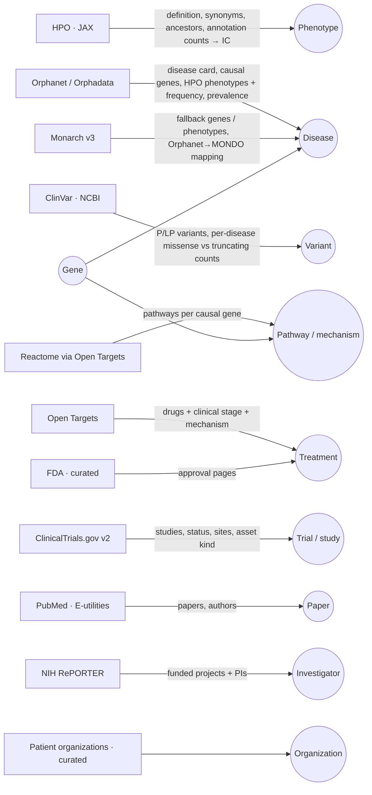

# Data sources

Every source is open, has a public API and a license that allows reuse with attribution. Every evidence row in the graph stores `source`, `external_id`, `url` and `retrieved_at`; an edge without evidence never enters the graph (Postgres trigger + loader filter).

## What feeds which part of the graph

## Source by source

| Source (`source` id) | What we take | Endpoint | Key | License |
| --- | --- | --- | --- | --- |
| Orphanet / Orphadata (`orphanet`) | Disease card by ORPHAcode, disease-causing genes (with HGNC), HPO phenotypes with frequency, prevalence, natural history, OMIM/MONDO cross-references, Spanish preferred term | `https://api.orphadata.com/{rd-cross-referencing,rd-associated-genes,rd-phenotypes,rd-epidemiology,rd-natural_history}/orphacodes/{code}?lang=en` | No | CC BY 4.0 |
| HPO · JAX (`hpo`) | Term definition, synonyms, parents/ancestors, number of annotated diseases (→ information content) | `https://ontology.jax.org/api/hp/terms/{HP:id}` | No | HPO license |
| Monarch v3 (`monarch`) | Causal gene / phenotype fallback when Orphanet has none; Orphanet→MONDO mapping | `https://api-v3.monarchinitiative.org/v3/api/{association,search}` | No | CC BY 4.0 |
| ClinVar (`clinvar`) | Pathogenic / likely pathogenic variants per gene; full counts per gene **and ClinVar trait** (missense vs truncating) | `https://eutils.ncbi.nlm.nih.gov/entrez/eutils/{esearch,esummary}.fcgi?db=clinvar` | Optional `NCBI_API_KEY` | Public domain |
| ClinicalTrials.gov v2 (`ctgov`) | Studies per condition, status, phase, sites, sponsor; classified as natural history / registry / biomarker / cohort / interventional | `https://clinicaltrials.gov/api/v2/studies` | No | Public domain |
| Open Targets (`opentargets`) | Drugs and clinical candidates per disease with stage, mechanism and stopped reports | `POST https://api.platform.opentargets.org/api/v4/graphql` | No | CC0 |
| Reactome via Open Targets (`reactome`) | Pathways (and top-level term) of each causal gene — the mechanism layer used for clusters | same GraphQL, `target(ensemblId){pathways}` | No | CC BY 4.0 |
| PubMed (`pubmed`) | Recent papers per disease / gene with PMID, date, authors | `esearch` / `esummary` `db=pubmed` | Optional `NCBI_API_KEY` | Public domain (metadata) |
| NIH RePORTER (`nih_reporter`) | Funded projects (last 4 fiscal years) and their PIs (`profile_id`, institution) | `POST https://api.reporter.nih.gov/v2/projects/search` | No | Public domain |
| FDA (`fda`) | Curated approvals with the official FDA page (`supabase/seed/approvals.json`) | fda.gov pages | — | Public domain |
| Patient organizations (`patient_orgs`) | Name, country, official site, diseases, registry URL when published (`supabase/seed/organizations.json`) | curated | — | Public data of each organization |
| Nexmed analysis (`nexmed_analysis`) | Evidence row of **inferred** `similar_to` edges (method + score), always followed by the observed evidence behind it | `src/lib/atlas/analyze.ts` | — | MIT |
| OpenAI extraction (`openai_extraction`) | Claims extracted from a cited paper (`extractions` table); rendered as **extracted** edges with a PubMed evidence row, "needs expert review" | `POST /api/extract` | `OPENAI_API_KEY` | Derived, cites the paper |
| Community (`community`) | Community drafts (`proposals`): overlay only, **never evidence** | `submit_proposal()` RPC | — | User submitted |

## Edge kinds

| `kind` | Meaning | UI |
| --- | --- | --- |
| `observed` | A source states it | solid line |
| `inferred` | Nexmed analysis computed it from observed edges (similarity) | dashed |
| `extracted` | OpenAI pulled it from a cited paper; needs expert review | dotted + badge |
| `proposed` | Community draft; never evidence | ghost |

## The disease slice (21 monogenic diseases)

Every id was resolved and verified with `npx tsx scripts/resolve-seed.ts`: the ORPHAcode's preferred term and disease-causing gene come from Orphadata (or Monarch causal-gene associations when Orphadata lists none), the HGNC id is cross-checked with genenames.org, the MONDO id comes from Monarch's Orphanet mapping / Orphanet xrefs and must exist in Open Targets (KCNQ2-DEE is flagged `opentargets_indexed: false`), OMIM is the exact Orphanet mapping and the ClinVar trait name comes from MedGen. Unverifiable candidates are left out, not guessed (SCN2A-, SCN8A- and CACNA1A-related DEE have no gene-specific ORPHAcode).

| Expected mechanism | Diseases (gene) |
| --- | --- |
| Channelopathies / DEE | Dravet (SCN1A) · KCNQ2-DEE (KCNQ2) · KCNT1 epilepsy of infancy with migrating focal seizures (KCNT1) |
| Synaptic | STXBP1-DEE (STXBP1, Maria's demo case `disease:ORPHA:599373`) · SYNGAP1-DEE (SYNGAP1) |
| Transcription / chromatin | Rett (MECP2) · FOXG1 syndrome (FOXG1) · Angelman (UBE3A) · CDKL5 deficiency (CDKL5) |
| Lysosomal / NCL | CLN2 (TPP1) · CLN3 (CLN3) · CLN8 (CLN8) · Pompe (GAA) · Fabry (GLA) · Gaucher (GBA1) · Niemann-Pick C (NPC1) · MPS I (IDUA) · Krabbe (GALC) · Metachromatic leukodystrophy (ARSA) |
| Neuromuscular | Spinal muscular atrophy (SMN1) · Duchenne (DMD) |

The clusters shown in the app are **computed** (Louvain over phenotype + pathway + gene similarity), not this table: the table only says why each disease was chosen.

## What happens to each record

1. **Canonical id** (ORPHA, HGNC, HP, NCT, PMID, CHEMBL, REACT, NIH profile) → the entity key `(type, canonical_id)`, so re-running the ingest never duplicates. App ids are `${type}:${canonical_id}`.
2. Entity upsert merges props (`existing || new`, nulls never wipe data).
3. Edge upsert (`causes`, `has_phenotype`, `has_variant`, `studies`, `treats`, `supports`, `researches`, `participates_in`, `is_a`) — only with ≥ 1 evidence row.
4. Evidence with `source`, `external_id`, `url`, `published_on`, `retrieved_at` and a short quote when available.
5. Confidence comes from the source (HPO frequency, clinical stage, ClinVar significance, association type); otherwise 0.5 with `confidence_basis = 'source_default'`.
6. Sources that stop reporting an edge (e.g. a trial no longer recruiting) retract it (`status = 'retracted'`); it re-activates if reported again.

## How to run

| Command | What |
| --- | --- |
| `npx tsx scripts/resolve-seed.ts` | Verify / extend the disease slice (`supabase/seed/diseases.json`) |
| `npx tsx scripts/build-edge-seed.ts` | Regenerate `supabase/functions/ingest/seed.ts` from the seed JSON |
| `npm run ingest` | Local ingest of every seed disease into `data/atlas.json` (`--orpha=`, `--only=`, `--target=supabase` with `SUPABASE_SERVICE_ROLE_KEY`) |
| `npm run analyze` | Recompute analytics for `data/atlas.json` |
| `npm run snapshot` | Export the live Supabase graph (public key) to `data/atlas.json`, analytics included (`--check` prints counts only) |
| Edge Function `ingest` | Same sources inside Supabase, invoked by `pg_net` / `pg_cron` (`private.invoke_ingest(orpha, step)`), logged in `ingest_runs` |

## What never enters

- Individual patient data from any source.
- Forums or social media as clinical evidence.
- Any row without `url` and `retrieved_at`; any active edge without evidence.
