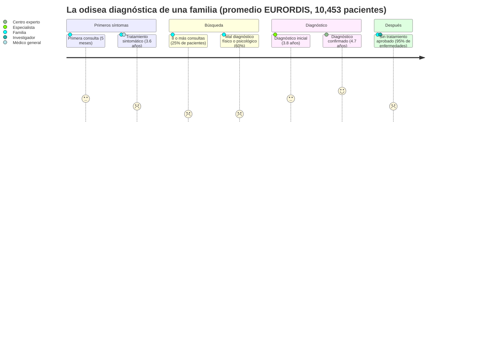
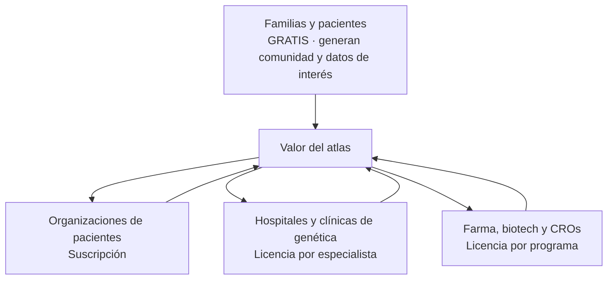

# Investigación: problema, mercado y modelo

Resumen ejecutable de lo que sustenta el pitch. Cada número tiene su fuente.

## El problema en una imagen

| Dato | Valor | Fuente |
| --- | --- | --- |
| Enfermedades raras conocidas | ~10,000; 80% genéticas; 70% empiezan en la infancia | [Buffalo Initiative · MIT Solve](https://solve.mit.edu/solutions/92088) |
| Personas afectadas | 300 a 400 millones en el mundo | [Buffalo Initiative](https://solve.mit.edu/solutions/92088), [Intuition Labs 2025](https://intuitionlabs.ai/articles/rare-disease-landscape-2025) |
| Sin tratamiento aprobado | 95% de las enfermedades | [Buffalo Initiative](https://solve.mit.edu/solutions/92088) |
| Tiempo a diagnóstico confirmado | 4.7 años (10.4 en adolescentes; 5.4 mujeres vs 3.7 hombres) | [EURORDIS Rare Barometer](https://devel.eurordis.org/wp-content/uploads/2024/05/Diagnosis-printer-.pdf) |
| 8 consultas o más antes del diagnóstico | 25% | EURORDIS |
| Mal diagnóstico previo | 60% físico, 60% psicológico o no tomados en serio | EURORDIS |
| Nunca referidos a un centro experto | 40% | EURORDIS |
| Mortalidad infantil | ~30% de los niños afectados mueren antes de los 5 años | [Intuition Labs](https://intuitionlabs.ai/articles/rare-disease-landscape-2025) |
| Costo anual en EE. UU. | ~US$997 mil millones (379 enfermedades analizadas) | Orphanet Journal of Rare Diseases 2022, vía Intuition Labs |

## Por qué el silo es el problema, no la falta de datos

Los datos existen: Orphanet, HPO, Monarch, ClinVar, ClinicalTrials.gov y PubMed son públicos. Lo que falta es la conexión entre ellos y una forma de preguntar en lenguaje natural sin que la IA invente. El reto 5 lo nombra: "fragmented across research silos".

## Mercado y comprador (B2B al sector salud)

| Comprador | Dolor que paga | Dato que lo sustenta |
| --- | --- | --- |
| Farma, biotech, CROs | Reclutar pacientes para ensayos de enfermedades raras | Más del 80% de los ensayos se retrasan o cierran por reclutamiento; US$600 mil a US$8 millones por día de retraso; 40% del presupuesto va a reclutar. [Emmes 2024](https://www.theemmesgroup.com/system/files/Emmes%20-%20Infographic%20-%20Patient%20Recruitment%20in%20Rare%20Disease.pdf) |
| Hospitales y clínicas | Diagnóstico tardío y sin referencia a centros expertos | 4.7 años; 40% nunca referidos. EURORDIS |
| Organizaciones de pacientes | Mantener informada a su comunidad y conectar con investigación | 1,000 organizaciones en 74 países solo en EURORDIS. [EURORDIS](https://devel.eurordis.org/who-we-are/our-members) |
| Tamaño del mercado farmacéutico | — | Medicamentos huérfanos ~US$216 mil millones en 2025; ~20% de ventas de prescripción en 2030. [Intuition Labs](https://intuitionlabs.ai/articles/rare-disease-landscape-2025) |

## Precios (hipótesis a validar hoy con entrevistas)

| Segmento | Precio hipótesis | Qué incluye |
| --- | --- | --- |
| Familias | Gratis | Guía de voz, atlas, ensayos, comunidades |
| Organizaciones de pacientes | US$100 a 500 / mes | Atlas con su marca, panel de comunidad, alertas |
| Clínicas | US$200 / especialista / mes | Analista clínico por fenotipo, citas, exportar resumen |
| Farma y CROs | US$50 a 250 mil / programa / año | Mapa de evidencia, huecos, comunidad de investigadores, contacto con consentimiento |

Escenario ilustrativo a 3 años (no proyección): 150 organizaciones × US$3,000 + 10 programas × US$120,000 ≈ **US$1.65 millones anuales**.

## Validación pendiente (hoy)

- [ ] Entrevista a un médico: ¿usaría el analista por fenotipo? ¿Qué le falta?
- [ ] Entrevista a un familiar de paciente: ¿la guía de voz le ayuda? ¿Qué pregunta primero?
- [ ] Entrevista a alguien de farma o investigación: ¿pagaría por el mapa de huecos? ¿Cuánto?

## Fuentes abiertas (para la sección de datos)

Ver `docs/DATA_SOURCES.md`.
