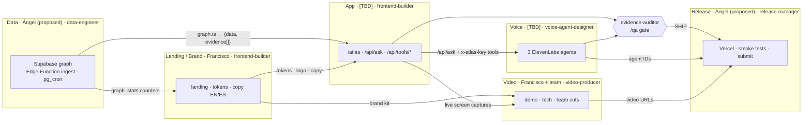
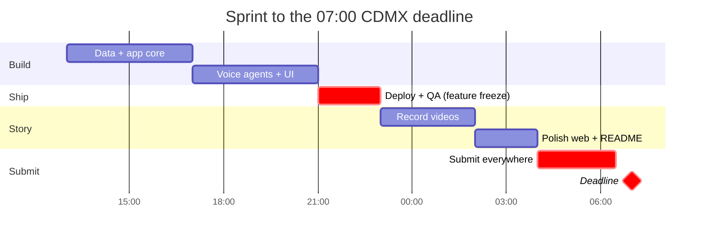
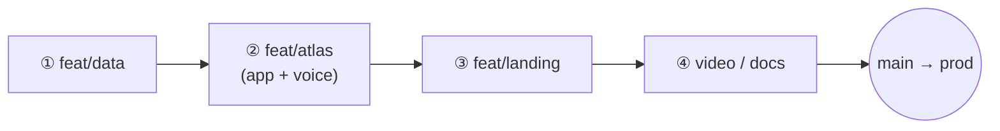
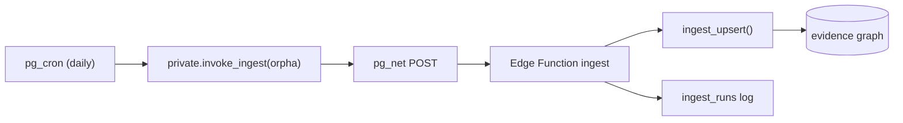

# Nedamex · Team workflow (humans + Claude Code agents)

> **Resumen (ES)**
> - **6 carriles**: Datos · App · Landing/Marca · Voz · Video · Release. Cada carril tiene 1 humano, 1 subagente de Claude y su rama `feat/<carril>` en su propio *worktree*.
> - **Cada quien edita solo sus rutas** (tabla §2). Si necesitas algo de otro carril, pídelo con `/handoff`. No lo edites tú.
> - **"Listo" = verificado:** `typecheck · lint · test · build`, más `/qa` si toca respuestas. Luego `/ship` → PR → preview de Vercel → *squash* a `main`.
> - **Regla de oro:** ninguna afirmación sin `evidence_id`. Nunca inventamos datos, IDs ni personas. "No es consejo médico" en cada respuesta.
> - **Entrega:** todo enviado a las **06:30 CDMX** (app.hack-nation.ai + Google Form + LinkedIn). El límite real es 07:00.

## 1. Lanes and hand-offs



Owners marked *(proposed)* or `[TBD]` are assigned by Francisco at kickoff.

## 2. Who owns which paths

| Lane | Human | Claude subagent | Owns (edit only these) | Hands off to |
|---|---|---|---|---|
| Lead | Francisco | n/a | `globals.css` · `layout.tsx` · `DESIGN.md` · `src/components/brand/**` · `src/lib/i18n.tsx` · `src/lib/site.ts` · `package.json` · `next.config.ts` | everyone (tokens, copy, deps) |
| Data | Ángel *(proposed)* | `data-engineer` | `supabase/**` · `scripts/ingest/**` · `src/lib/graph.ts` | App (`graph.ts` contract) |
| App | `[TBD]` | `frontend-builder` · `evidence-auditor` | `src/app/atlas/**` · `src/components/atlas/**` · `src/app/api/**` · `src/lib/atlas-data.ts` · `src/data/**` · `src/lib/verifier*` | Voice, Video, Release |
| Voice | `[TBD]` | `voice-agent-designer` | `src/lib/agents/**` + ElevenLabs config (sub-lane of App, same branch `feat/atlas`) | Release (agent IDs) |
| Landing | Francisco | `frontend-builder` | `src/app/page.tsx` · `src/components/landing/**` | Release |
| Video | Francisco + team | `video-producer` | `video/**` | Release (URLs) |
| Release / workflow | Ángel *(proposed)* | `release-manager` | `README.md` · `docs/WORKFLOW.md` · `CLAUDE.md` · `AGENTS.md` (below the Next block) · `.claude/**` · `.mcp.json` | judges |

**Shared state:** Supabase is one database for everyone. Only the Data lane runs migrations and deploys functions; every other lane reads.

## 3. Timeline to 07:00 CDMX (Sat 3 → Sun 4 Oct)



| Slot (CDMX) | Goal | Exit gate (all must be true) |
|---|---|---|
| **13:00–17:00** | Data + app core | 5 diseases ingested · orphan edges = 0 · `/api/ask` returns cited answers · `/atlas` renders real data |
| **17:00–21:00** | Voice + UI | 3 ElevenLabs agents answer EN/ES through `ask_atlas` · voice in `/atlas` · landing complete EN/ES |
| **21:00–23:00** | Deploy + QA | prod on Vercel · env complete · `/qa` = SHIP · smoke tests green · **feature freeze 23:00** |
| **23:00–02:00** | Record videos | demo, tech and team cuts rendered and uploaded (unlisted) |
| **02:00–04:00** | Polish | README final · video links live on site · copy pass EN/ES · 390 px check |
| **04:00–06:30** | Submit | app.hack-nation.ai + Google Form + LinkedIn done · confirmation screenshots · **no deploys after 05:30 except hotfixes** |

## 4. Three parallel Claude Code sessions (git worktrees)

```bash
# once, from the main checkout
git fetch origin && git switch main && git pull
git worktree add ../nedamex-data    -b feat/data
git worktree add ../nedamex-atlas   -b feat/atlas
git worktree add ../nedamex-landing -b feat/landing
for w in data atlas landing; do cp .env.local ../nedamex-$w/ && (cd ../nedamex-$w && npm ci); done

# one terminal per session
cd ../nedamex-data    && claude          # session 1 · Data            (no dev server needed)
cd ../nedamex-atlas   && claude          # session 2 · App + Voice     npm run dev -- -p 3001
cd ../nedamex-landing && claude          # session 3 · Landing + Video npm run dev -- -p 3002
```

| Session | Worktree / branch | Lead subagent(s) | First prompt (example) |
|---|---|---|---|
| 1 · Data | `../nedamex-data` · `feat/data` | `data-engineer` | `@agent-data-engineer deploy ingest, schedule pg_cron for the 5 seeds, then /ingest-status` |
| 2 · App + Voice | `../nedamex-atlas` · `feat/atlas` | `frontend-builder` ‖ `voice-agent-designer` → `evidence-auditor` | `In parallel: frontend-builder builds the answer card with citations; voice-agent-designer wires ask_atlas. Then /qa.` |
| 3 · Landing + Video | `../nedamex-landing` · `feat/landing` | `frontend-builder` ‖ `video-producer` | `frontend-builder: landing hero with live graph_stats; video-producer: /video-scene TitleCard` |
| Release | main checkout | `release-manager` | `@agent-release-manager env matrix vs Vercel, then smoke-test the preview` |

**Merge order** (each one is `/ship` → PR → Vercel preview → squash-merge. After every merge, the other worktrees run `git fetch origin && git rebase origin/main`):



Rules: one lane per session · never two agents on the same file · fan out subagents only across disjoint paths · builds in a shared checkout use `NEXT_DIST_DIR=.next-<lane>`.
Built-in alternative: `claude -w atlas` creates `.claude/worktrees/atlas` on branch `worktree-atlas`. Add `.env.local` to a `.worktreeinclude` file so it is copied in.
Cleanup after the event: `git worktree remove ../nedamex-<lane>`.

## 5. Claude Code kit (in this repo)

| Kind | Name | What it does |
|---|---|---|
| Command | `/ship [msg]` | verify → commit → push → PR → Vercel preview URL |
| Command | `/qa [url]` | evidence-auditor: verifier tests, integrity SQL, EN/ES red-team, secret scan |
| Command | `/new-disease ORPHA:x` | seed → bundle → deploy `ingest` → pg_net trigger → counts |
| Command | `/ingest-status` | `ingest_runs`, `graph_stats`, cron and pg_net health |
| Command | `/video-scene <Id>` | still + render of one Remotion composition |
| Command | `/handoff <lane>` | writes `docs/handoffs/<date>-<lane>.md` |
| Subagents | `.claude/agents/*` | data-engineer · frontend-builder · evidence-auditor · voice-agent-designer · video-producer · release-manager |
| QA kit | `.claude/qa/*` | `integrity.sql` · `redteam.json` (10 EN/ES attacks) · `redteam.mjs` |
| MCP | `.mcp.json` | supabase · vercel · github · elevenlabs · lovable |

**One-time setup per laptop**

```bash
# prerequisites: Node 22, uv (for uvx), gh
export ELEVENLABS_API_KEY=…                # ElevenLabs → Profile → API keys
export GITHUB_MCP_PAT=$(gh auth token)     # or a fine-grained PAT (repo scope)
claude                                     # trust the folder, approve project MCP servers
/mcp                                       # Authenticate: supabase, vercel, lovable (browser OAuth)
```

**Lovable (researcher portal).** The official Lovable MCP (`https://mcp.lovable.dev`, OAuth) is in `.mcp.json`. On claude.ai go to Settings → Connectors → *Add custom connector*, then set URL `https://mcp.lovable.dev`. The portal uses the **same Supabase** through Lovable's Supabase integration with the **anon key + RLS only**. The service role must never be in Lovable code. Ángel owns the Lovable project. Its URL goes in `NEXT_PUBLIC_RESEARCH_PORTAL_URL`.

## 6. Submission checklist

- [ ] **Demo video** (live product, EN) → URL in `NEXT_PUBLIC_VIDEO_DEMO`
- [ ] **Tech video** (architecture, evidence trigger, verifier, agents) → `NEXT_PUBLIC_VIDEO_TECH`
- [ ] **Team video** (real team, real voices) → `NEXT_PUBLIC_VIDEO_TEAM`
- [ ] **Public GitHub repo**: README final · no secrets (`git log -p | grep -E "sb_secret_|sk-[A-Za-z0-9]{20}"` is empty) · repo visibility public
- [ ] **Live demo URL** `https://nedamex.vercel.app`: smoke tests green · voice works · 390 px OK
- [ ] **app.hack-nation.ai**: project submitted for Challenge 5 · confirmation screenshot
- [ ] **Google Form** submitted
- [ ] **LinkedIn** post (demo link + repo + team tags)

Copy-paste kit (confirm the exact field names on each form):

| Field | Value |
|---|---|
| Project | Nedamex |
| Tagline | Rare disease, mapped. Every answer traced to its source. |
| Challenge | 5 · AI Atlas for Rare Diseases (Buffalo Initiative × OpenAI) |
| Short description | Nedamex links open rare-disease sources into an evidence graph where no edge exists without a source. Voice agents for families, clinicians and researchers answer only with cited evidence. A deterministic verifier drops anything unsourced. |
| Repo | https://github.com/perdomoangelrangel-tech/7th-Hack-Nation-Global-AI-Hackathon-proyect |
| Demo | https://nedamex.vercel.app |
| Stack | Supabase (Postgres, Edge Functions, pg_cron) · Next.js on Vercel · ElevenLabs Agents · OpenAI / Claude · Lovable |
| Team | `[Name] · [Role]` (one row per member) |

## 7. After the hackathon: daily ops



| Task | How |
|---|---|
| Check health | `/ingest-status` (failed runs, stale cron, pg_net errors) |
| Add a disease | `/new-disease ORPHA:<code>` (Data lane), then commit `diseases.json` + `seed.ts` |
| Weekly QA | `/qa https://nedamex.vercel.app` |
| Rotate keys used during the event | `update app_secrets set value = gen_random_uuid()::text where name = 'ingest_key';` · new `ATLAS_TOOLS_KEY` in Vercel + ElevenLabs |
| One scheduler only | pg_cron is the source of truth. Disable the schedule in `.github/workflows/ingest.yml`, or keep it only as a manual `workflow_dispatch` fallback |
| Scale | swap the seed list for Orphadata `rd-classification` (5,000+ monogenic diseases). Same function, same contract |
